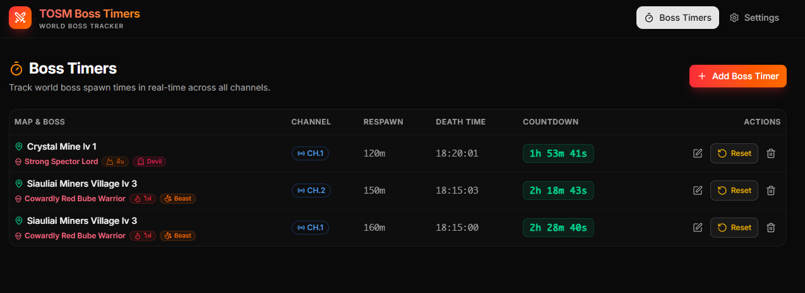

# TOSM Boss Timers ⚔️

ระบบติดตามเวลาเกิดบอส (World Boss Tracker) สำหรับเกม Tree of Savior M (TOSM) ที่ช่วยให้ผู้เล่นสามารถเช็คเวลาเกิดของบอสในแต่ละแผนที่และแต่ละแชนแนลได้อย่างแม่นยำและใช้งานง่าย

**🌍 Live Demo:** [https://kruntum.github.io/boss-tracking/](https://kruntum.github.io/boss-tracking/)

---

## 📸 ภาพตัวอย่างระบบ (Preview)


_(หมายเหตุ: นำภาพหน้าจอที่คุณต้องการมาไว้ในโฟลเดอร์ `public/` แล้วตั้งชื่อไฟล์ว่า `preview.png` เพื่อให้ภาพแสดงขึ้นมาที่นี่)_

---

## ✨ ฟีเจอร์หลัก (Features)

- **ติดตามเวลาบอสเกิด (Real-time Countdown):** คำนวณเวลาที่บอสจะเกิดใหม่แบบเรียลไทม์ พร้อมระบบจัดเรียงบอสที่ใกล้เกิดที่สุดให้อยู่บนสุดเสมอ
- **การจัดการที่ยืดหยุ่น:** สามารถแก้ไขเวลารอเกิด (Respawn) และเวลาที่ตายล่าสุด (Death Time) ได้อิสระ เผื่อกรณีเวลาคลาดเคลื่อน
- **ข้อมูลครบถ้วน:** แสดงทั้งชื่อบอส, ธาตุ (เช่น ดิน น้ำ ลม ไฟ ความมืด สายฟ้า), และประเภทมอนสเตอร์ (เช่น Beast, Devil, Transcendent) ด้วยสีสันและไอคอนที่ดูง่าย
- **ระบบแผนที่และแชนแนล:** รองรับการจัดการแผนที่และแชนแนลแบบไม่จำกัด เพิ่ม/ลบ ข้อมูลแผนที่ได้เอง
- **ฐานข้อมูล Real-time:** ทำงานร่วมกับ Firebase ทำให้ข้อมูลเชื่อมต่อและอัปเดตตรงกันทุกคนในทันที

---

## 🚀 วิธีการใช้งานระบบ (How to Use)

### สำหรับผู้ใช้งานทั่วไป (การติดตามบอส)

1. เปิดหน้าแรก **Boss Timers**
2. คุณจะเห็นรายชื่อบอสเรียงลำดับตาม **"เวลาที่ใกล้เกิดที่สุด"** (บอสที่ยังไม่ถูกฆ่าจะอยู่ล่างสุด)
3. เมื่อบอสเกิดและถูกจัดการแล้ว ให้กดปุ่ม **Kill 💀** ระบบจะเริ่มนับเวลาเกิดใหม่ทันที
4. หากเวลาเพี้ยนหรือไม่ตรง สามารถกดปุ่ม **Edit ✏️** เพื่อตั้งเวลาที่ถูกฆ่า (Death Time) ใหม่ได้ด้วยตนเอง
5. หากบอสเกิดแล้วรอบนึง และต้องการล้างเวลา ให้กด **Reset 🔄**

### สำหรับผู้ดูแลระบบ (การตั้งค่า)

1. ไปที่เมนู **Settings ⚙️** มุมบนขวา
2. **การจัดการแผนที่ (Map Manager):** สามารถเพิ่มชื่อแผนที่, ชื่อบอสแท้จริง, ธาตุ, และประเภทของบอส ระบบจะนำข้อมูลนี้ไปแสดงเป็นป้ายกำกับในหน้าหลัก
3. **การจัดการแชนแนล (Channel Manager):** สามารถเพิ่มแชนแนลของเซิร์ฟเวอร์เพื่อให้ผู้เล่นเลือกรายงานเวลาได้
4. ในหน้า Settings สามารถกด **Edit** เพื่อแก้ไขข้อมูลเดิมได้ตลอดเวลา

---

## 💻 สำหรับนักพัฒนา (Development)

โปรเจกต์นี้สร้างขึ้นด้วย **React + Vite**, **TypeScript**, **Tailwind CSS**, และ **Firebase (Firestore)**

### การรันโปรเจกต์บนเครื่องของคุณ

1. Clone โปรเจกต์นี้ลงมาที่เครื่อง
2. ติดตั้ง Dependencies:
   ```bash
   npm install
   ```
3. รันเซิร์ฟเวอร์จำลอง:
   ```bash
   npm run dev
   ```
4. หากต้องการ Build โปรเจกต์เพื่อนำไปใช้งานจริง:
   ```bash
   npm run build
   ```

### 🔧 การตั้งค่า Firebase (Database Setup)

เพื่อให้ระบบบันทึกเวลาบอส แผนที่ และแชนแนลต่างๆ ได้แบบออนไลน์ (Real-time) โปรเจกต์นี้จำเป็นต้องเชื่อมต่อกับ **Firebase Firestore** ครับ

**ขั้นตอนการติดตั้งและตั้งค่า:**

1. **สร้างโปรเจกต์ Firebase:**
   - ไปที่ [Firebase Console](https://console.firebase.google.com/) แล้วกดปุ่ม **Add project**
   - ตั้งชื่อโปรเจกต์ของคุณ (เช่น `tosm-boss-tracker`)
   - กดยอมรับและ Create Project ให้เรียบร้อย
2. **สร้างแอปบนเว็บ (Web App):**
   - เมื่อเข้าสู่หน้าแดชบอร์ดของโปรเจกต์แล้ว ให้คลิกที่ไอคอน **</>** (Web) เพื่อสร้าง Web App
   - กรอกชื่อแอป (App nickname) คล้ายคลึงกับชื่อโปรเจกต์
   - สมัครเสร็จสิ้น Firebase จะให้ชิ้นส่วนโค้ดที่มีค่า Configuration อย่าง `apiKey`, `authDomain`, `projectId` เป็นต้น
3. **เปิดใช้งาน Cloud Firestore:**
   - มองหาเมนูซ้ายมือ เลือก **Build > Firestore Database** แล้วกด **Create database**
   - แนะนำให้เลือก **Start in test mode** ก่อนสำหรับการพัฒนาตั้งต้น (เพื่อให้สามารถอ่านเขียนได้ทันที)
   - เลือก Location ที่ใกล้คุณที่สุด (เช่น `asia-southeast1`)
4. **นำ Configuration มาใส่โปรเจกต์ที่เครื่อง:**
   - ที่หน้าแรกของโปรเจกต์ (โฟลเดอร์เดียวกันกับ `package.json`) ให้สร้างไฟล์ใหม่ชื่อ `.env` โดยยึดรูปแบบจากโค้ดที่คุณได้มาตอนสร้างแอป:
     ```env
     VITE_FIREBASE_API_KEY="ใส่ข้อมูลที่นี่"
     VITE_FIREBASE_AUTH_DOMAIN="ใส่ข้อมูลที่นี่"
     VITE_FIREBASE_PROJECT_ID="ใส่ข้อมูลที่นี่"
     VITE_FIREBASE_STORAGE_BUCKET="ใส่ข้อมูลที่นี่"
     VITE_FIREBASE_MESSAGING_SENDER_ID="ใส่ข้อมูลที่นี่"
     VITE_FIREBASE_APP_ID="ใส่ข้อมูลที่นี่"
     ```
   - นำค่า Configuraiton จากข้อ 2 มาใส่ให้ตรงกับชื่อ Key แต่ละอันให้ครบถ้วน

เมื่อเสร็จสิ้นขั้นตอนนี้ รีสตาร์ทเซิร์ฟเวอร์ (`npm run dev`) โปรเจกต์จะเชื่อมเข้ากับฐานข้อมูลของคุณอัตโนมัติแล้วครับ ลองสร้างแผนที่ และสร้างแชนแนลได้เลย!
